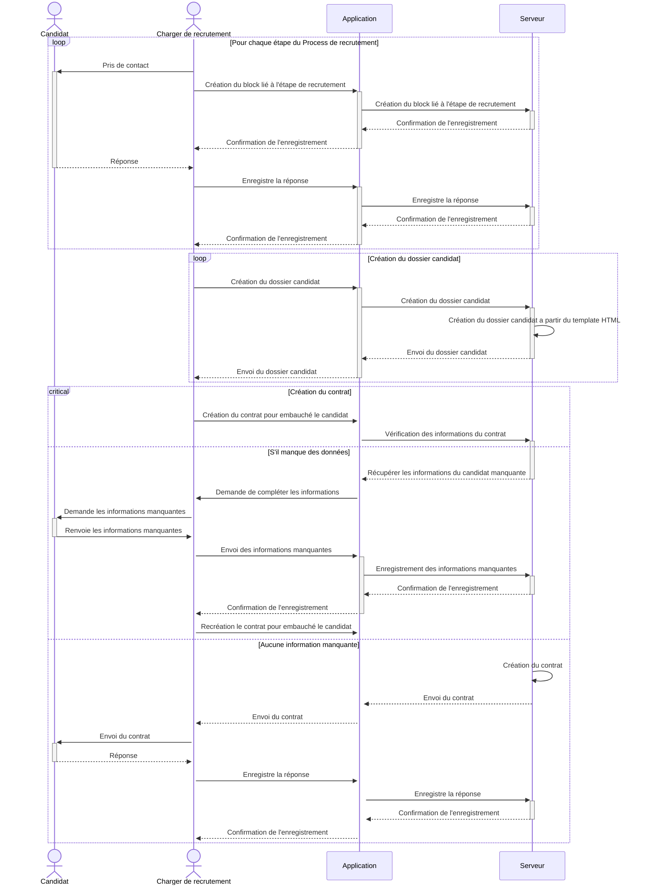
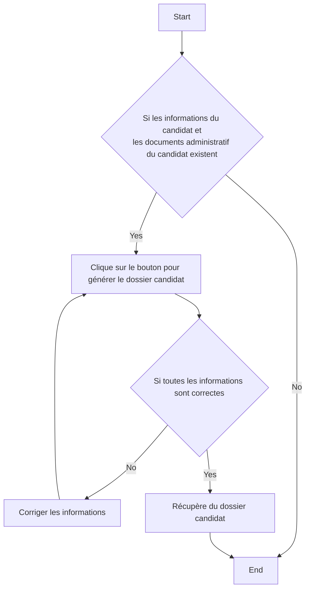
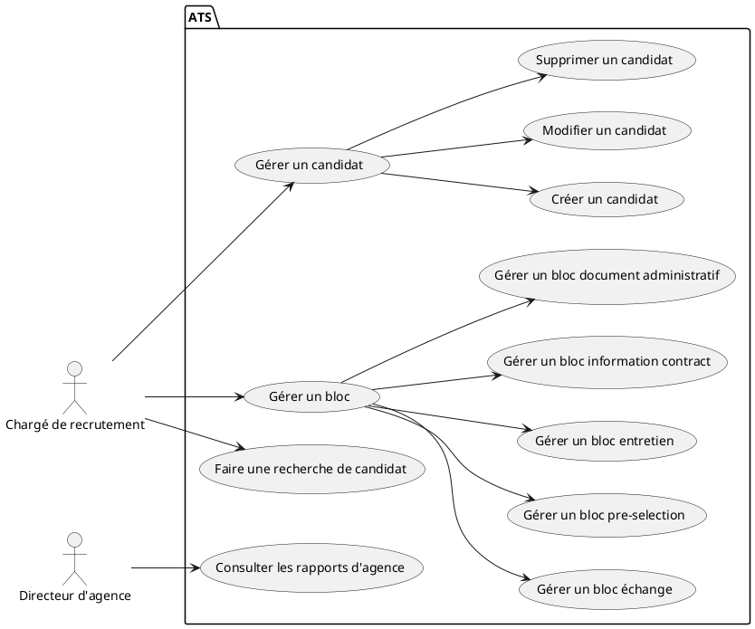
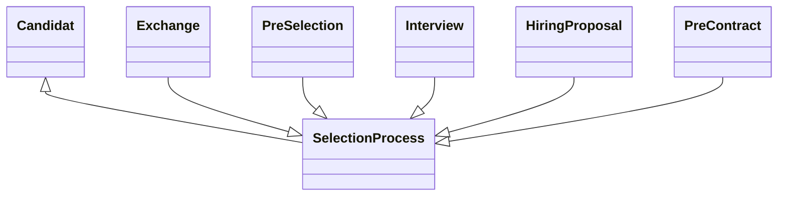

# CompoMetier

Repo pour les schéma de cours d'atelier métier

## Diagram de séquence

## Diagram d'activité

Diagram d'activité pour la génération de dossier candidat

## Diagram de cas d'utilisation

## Merise

