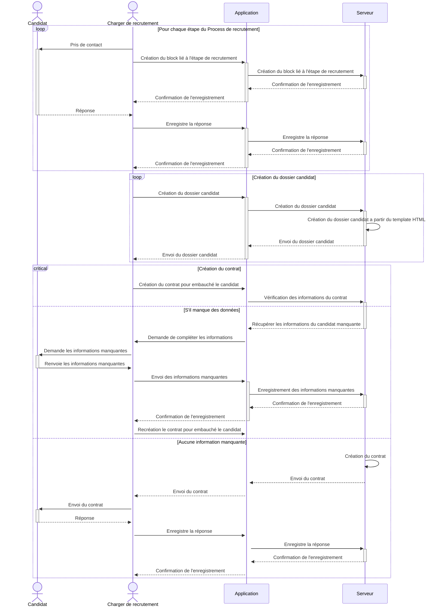

# CompoMetier

Repo pour les schéma de cours d'atelier métier

## Diagram de séquence

```mermaid
sequenceDiagram
    actor C as Candidat
    actor CR as Charger de recrutement
    participant Front as Application
    participant Back as Serveur

    loop Pour chaque étape du Process de recrutement
        CR->>+C: Pris de contact
        CR->>+Front: Création du block lié à l'étape de recrutement
        Front->>+Back: Création du block lié à l'étape de recrutement
        Back-->>-Front: Confirmation de l'enregistrement
        Front-->>-CR: Confirmation de l'enregistrement
        C-->>-CR: Réponse
        CR->>+Front: Enregistre la réponse
        Front->>+Back: Enregistre la réponse
        Back-->>-Front: Confirmation de l'enregistrement
        Front-->>-CR: Confirmation de l'enregistrement
    end

    loop Création du dossier candidat
        CR->>+Front: Création du dossier candidat
        Front->>+Back: Création du dossier candidat
        Back->>Back: Création du dossier candidat a partir du template HTML
        Back-->>-Front: Envoi du dossier candidat
        Front-->>-CR: Envoi du dossier candidat
    end

    critical Création du contrat
        CR->>+Front: Création du contrat pour embauché le candidat
        Front->>+Back: Vérification des informations du contrat
    Option S'il manque des données
        Back-->>-Front: Récupérer les informations du candidat manquante
        Front->>+CR: Demande de compléter les informations
        CR->>+C : Demande les informations manquantes
        C->>-CR : Renvoie les informations manquantes
        CR->>+Front: Envoi des informations manquantes
        Front->>+Back: Enregistrement des informations manquantes
        Back-->>-Front: Confirmation de l'enregistrement
        Front-->>-CR: Confirmation de l'enregistrement
        CR->>+Front: Recréation le contrat pour embauché le candidat
    Option Aucune information manquante
        Back->>Back: Création du contrat
        Back-->>Front: Envoi du contrat
        Front-->>CR: Envoi du contrat
        CR->>+C: Envoi du contrat
        C-->>-CR: Réponse
        CR->>+Front: Enregistre la réponse
        Front->>+Back: Enregistre la réponse
        Back-->>-Front: Confirmation de l'enregistrement
        Front-->>CR: Confirmation de l'enregistrement
    end
```
